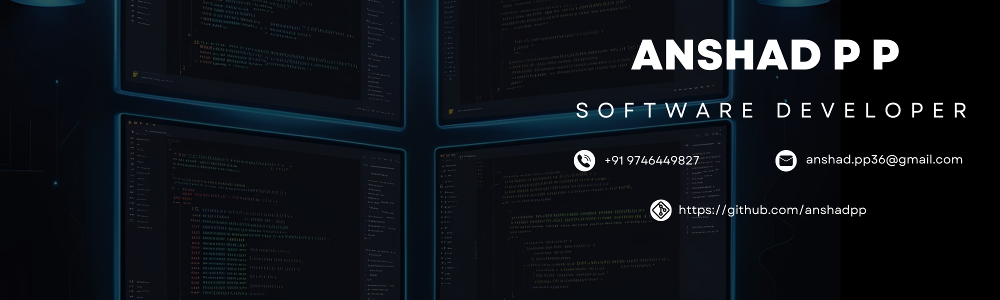

<!-- Banner Image -->

<!-- Main Container -->

  <!-- Header Section -->
  <h1 align="center">Hi, I'm Anshad P P 👋</h1>
  <h3 align="center">Full Stack Developer | Tech Enthusiast</h3>
  
  <!-- Social Links -->
  

    <a href="https://in.linkedin.com/in/anshad-p-p" style="color:#ffffff; text-decoration:none;">LinkedIn</a> &nbsp;|&nbsp;
    <a href="https://github.com/anshadpp" style="color:#ffffff; text-decoration:none;">GitHub</a> &nbsp;|&nbsp;
    <a href="mailto:anshad.pp36@gmail.com" style="color:#ffffff; text-decoration:none;">Email</a>
  

  
  

  <!-- About Me & Contact Info -->
  

    <h2>About Me</h2>
    

      I'm a Full Stack Developer originally from Kerala, India, now based in Hyderabad, Telangana. I specialize in creating scalable web and mobile applications with modern technologies and innovative solutions.
    

    <h2>Contact Information</h2>
  
    <ul style="list-style-type: none; padding-left: 0;">
      <li><strong>Location:</strong> Kerala, India</li>
      <li><strong>Current Location:</strong> Hyderabad, Telangana</li>
      <li><strong>Phone:</strong> +91 9746449827</li>
      <li><strong>Email:</strong> <a href="mailto:anshad.pp36@gmail.com" style="color: #ffffff;">anshad.pp36@gmail.com</a></li>
    </ul>
  

  

    <h2>Connect With Me</h2>
    

      
      
      
    

  

  <!-- Technical Expertise -->
  

    <h2>Technical Expertise</h2>
    <ul>
      <li><strong>Languages:</strong> Java, Dart, Python, JavaScript, C</li>
      <li><strong>Backend:</strong> Spring Boot, Django</li>
      <li><strong>Frontend:</strong> HTML, CSS, JavaScript, AJAX, jQuery, JSP</li>
      <li><strong>Mobile:</strong> Flutter & Dart (using provider packages)</li>
      <li><strong>Cloud & DevOps:</strong> AWS, Firebase, Git & GitHub, REST APIs</li>
      <li><strong>Databases:</strong> MySQL</li>
    </ul>
  

  <!-- Work Experience -->
  

    <h2>Work Experience</h2>
    <h3>Backend Developer <small>(Peninsula Football Academy - Client: Saudi Arabia)</small></h3>
    
<em>October 2024 - Present</em>

    <ul>
      <li>Developed backend systems for a football academy management app (Android & iOS).</li>
      <li>Built REST APIs using Spring Boot and managed data with Hibernate/MySQL.</li>
      <li>Integrated cloud solutions including Amazon S3 and Firebase notifications.</li>
    </ul>
    <h3>Full Stack Web Developer Trainee <small>(Incube Innovation Incubator LLP, Hyderabad)</small></h3>
    
<em>July 2024 – Present</em>

    <ul>
      <li>Created full-stack projects and mobile apps using Flutter & Dart.</li>
      <li>Integrated third-party APIs and implemented cloud solutions on AWS and Firebase.</li>
      <li>Enhanced project performance through code reviews and secure token-based verification.</li>
    </ul>
    
    
  

  <!-- Certifications & Education -->
  

    <h2>Certifications & Education</h2>
    <h3>Certifications</h3>
    <ul>
      <li>Prompt Engineering for ChatGPT – Coursera (Aug 2024)</li>
      <li>Introduction to Watson AI – EdX (Aug 2023)</li>
      <li>Python Web Developer – L&T EduTech (Jul 2023)</li>
      <li>Python Basics for Data Science – EdX (Jul 2023)</li>
    </ul>
    <h3>Education</h3>
    <ul>
      <li>B.Tech in Computer Science and Engineering, MGMCEPS Valanchery (2020 – 2024)</li>
    </ul>
    
    
  

  
  <!-- Resume & Connect -->

  

 

<!-- GitHub Stats Section -->

  <h2>GitHub Stats</h2>
  

    
  

  

    
  

  

    
  

